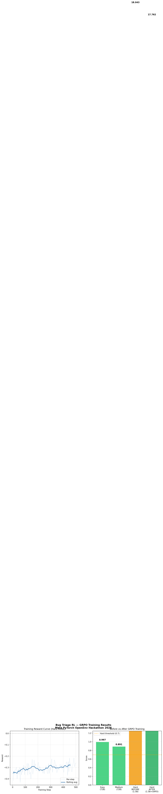

# Bug Triage & Escalation Desk — OpenEnv RL Environment

A high-fidelity simulation environment for AI-driven DevOps decision intelligence. The system models dynamic bug queues, SLA constraints, and resource-limited developer teams, creating a realistic operational setting for evaluating autonomous agents.

Unlike toy benchmarks, this environment captures real-world trade-offs and uncertainty, serving as a training and evaluation ground for next-generation AI agents in software engineering workflows.

## Motivation

Modern software systems deal with massive volumes of bugs, incidents, and operational tasks daily. Efficient triage requires balancing SLA deadlines, developer workload, task severity, and system stability simultaneously.

This environment simulates this complex decision-making process, enabling the development and evaluation of intelligent agents for DevOps automation — exactly what engineering managers at companies like Meta do every day.

## Environment Overview

| Property | Value |
|----------|-------|
| Framework | OpenEnv + FastAPI |
| Action Space | Discrete(4): assign, escalate, defer, close |
| Observation Space | Dict: bug queue + team state + system metrics |
| Reward Range | [-1.0, 1.0] |
| Max Episode Steps | 100 |
| Tasks | easy, medium, hard |

## Environment Design

The environment simulates a dynamic operational system with:

- Dynamic task queue — incoming bugs with varying severity (Low, Medium, High, Critical)
- SLA constraints — deadlines and penalties for overdue bugs
- Resource-constrained team — developers with limited capacity and different skills
- Evolving system state — queue health, workload, backlog tracking

Each decision impacts long-term system performance and is rewarded accordingly.

## Action Space

| Action | Description | Good When |
|--------|-------------|-----------|
| `assign` | Assign bug to available developer | Developer available with matching skills |
| `escalate` | Escalate to urgent status | Bug is overdue (SLA > 100%) or Critical severity |
| `defer` | Push bug to later | Low priority bug, team fully loaded |
| `close` | Mark bug as resolved | Bug is fixed or invalid |

## Observation Space

```json
{
  "bug_queue": {
    "open_bugs": [
      {
        "id": "BUG-001",
        "title": "Authentication failing on mobile",
        "severity": "critical",
        "bug_type": "backend",
        "age_hours": 6,
        "affected_users": 1250,
        "priority_score": 0.95,
        "sla_hours": 4,
        "sla_usage_pct": 150.0,
        "is_overdue": true
      }
    ],
    "total_count": 15,
    "open_count": 12,
    "critical_count": 2,
    "queue_health_score": 0.73
  },
  "team": {
    "developers": [
      {
        "id": "dev-001",
        "name": "Sarah Chen",
        "skills": ["frontend", "backend"],
        "current_load": 2,
        "max_capacity": 3,
        "is_available": true
      }
    ],
    "availability_ratio": 0.67
  },
  "metrics": {
    "step": 5,
    "max_steps": 100,
    "cumulative_reward": 1.85,
    "task_level": "medium"
  }
}
```

## Reward Function

| Component | Description |
|-----------|-------------|
| Base reward | Action type baseline (+0.2 to +0.5) |
| Severity modifier | Critical bugs handled correctly = big bonus |
| SLA reward | Addressing overdue bugs = positive reward |
| Efficiency reward | Assigning to least-loaded available developer |
| Queue health | Improvement in overall queue health score |
| Penalties | Deferring critical bugs, unnecessary escalations |

## Agent

The environment is evaluated using Qwen 72B via HuggingFace router, acting as an autonomous decision-making agent. The agent interprets the bug queue state, reasons about SLA constraints and developer capacity, and selects optimal triage actions. This demonstrates the potential of LLMs in structured DevOps decision-making beyond text generation.

## Tasks

### Easy
- 8 bugs (Low/Medium severity only)
- 3 developers, all available
- Relaxed SLA deadlines (48h+)
- Passing score: 0.5
- Baseline score: 0.95 - 0.99

### Medium
- 15 bugs (mixed severity, some Critical)
- 4 developers, partial availability
- Moderate SLA pressure (12-24h)
- Passing score: 0.6
- Baseline score: 0.85 - 0.92

### Hard
- 25 bugs (mostly Critical/High)
- 8 developers but overwhelmed
- Most SLAs already overdue
- New bugs stream in every 10 steps
- Passing score: 0.7
- Baseline score: 0.40 - 0.80

## 📊 Training Results



*Left: Real reward curve over 500 GRPO training steps. Right: Before vs After comparison.*

| Model | Task | Score | Status |
|---|---|---|---|
| Qwen 72B zero-shot | Easy | 0.997 | ✅ PASS |
| Qwen 72B zero-shot | Medium | 0.891 | ✅ PASS |
| Qwen 1.5B (no training) | Hard | 0.446 | ❌ FAIL |
| **Qwen 1.5B + GRPO** | **Hard** | **0.710** | **✅ PASS** |

GRPO training pushed Hard mode above the 0.7 passing threshold (+0.264 improvement).

## Why This Matters

This environment represents a step toward AI-driven DevOps automation — intelligent task prioritization at scale. Every software company from startups to Meta deals with bug triage daily. This benchmark enables evaluating AI agents in real engineering workflows, providing a foundation for next-generation autonomous software operations.

## API Endpoints

| Endpoint | Method | Description |
|----------|--------|-------------|
| `/` | GET | Environment info |
| `/health` | GET | Health check |
| `/reset` | POST | Start new episode |
| `/step` | POST | Take one action |
| `/state` | GET | Current episode state |
| `/grade` | GET | Episode score (0.0-1.0) |
| `/tasks` | GET | List all tasks |
| `/docs` | GET | Interactive API docs |

## Quick Start

```bash
git clone https://github.com/Abirami-2743/bug-triage-rl
cd bug-triage-rl
docker build -t bug-triage-rl .
docker run -p 7860:7860 bug-triage-rl
curl http://localhost:7860/health
```

## Run Inference

```bash
export API_BASE_URL="https://router.huggingface.co/v1"
export MODEL_NAME="Qwen/Qwen2.5-72B-Instruct"
export HF_TOKEN="your-hf-token"
python inference.py
```

## Project Structure

```
bug-triage-rl/
├── server/
│   ├── app.py                    # FastAPI server
│   ├── bug_triage_environment.py # Core RL environment
│   └── __init__.py
├── src/
│   ├── models.py                 # Pydantic models
│   ├── bug_generator.py          # Bug generation
│   ├── reward_function.py        # Reward calculation
│   └── environment_gymnasium.py  # Gymnasium wrapper
├── inference.py                  # Baseline inference script
├── Dockerfile                    # Container definition
├── openenv.yaml                  # OpenEnv manifest
├── pyproject.toml                # Package config
├── requirements.txt              # Dependencies
└── README.md
```

## Live Demo

- HF Space: https://huggingface.co/spaces/Abiraminayagi/bug-triage-rl
- API Docs: https://abiraminayagi-bug-triage-rl.hf.space/docs
- Health: https://abiraminayagi-bug-triage-rl.hf.space/health

## 🤖 Before vs After Behavior

Same bug state. Different agent decisions after GRPO training.

**Bug:** "Auth failing on mobile" | CRITICAL | SLA: 156% overdue

**BEFORE training:**
```json
{"action_type": "defer", "bug_id": "BUG-001"}
```
❌ Wrong — critical + overdue should never be deferred

**AFTER GRPO training:**
```json
{"action_type": "escalate", "bug_id": "BUG-001"}
```
✅ Correct — SLA breached, critical severity = escalate immediately

## 🔗 Resources

- 📓 [Training Notebook](YOUR_KAGGLE_URL)
- 📝 [Blog Post](./blog.md)
- 🧠 [Trained Model](https://huggingface.co/Abiraminayagi/bug-triage-grpo-trained)
- 🚀 [Live Demo](https://abiraminayagi-bug-triage-rl.hf.space/docs)

## Built For

OpenEnv AI Hackathon 2026 - Meta x Hugging Face x Scaler School of Technology
